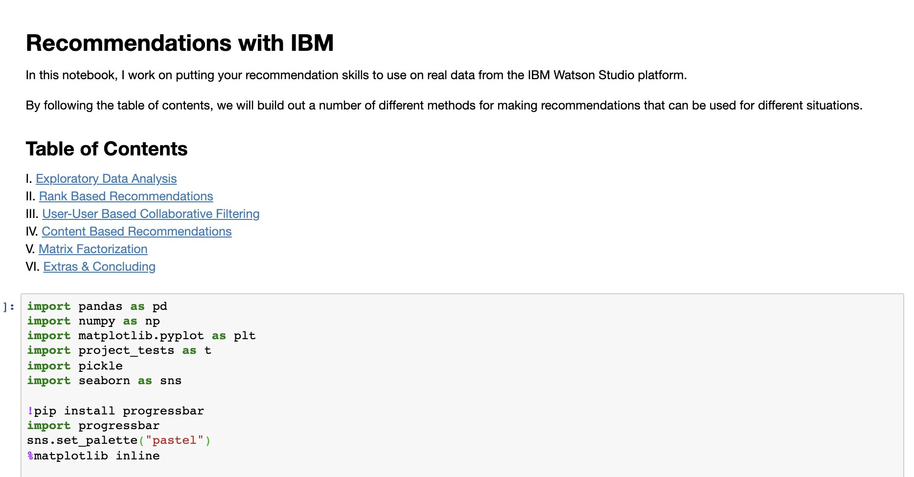
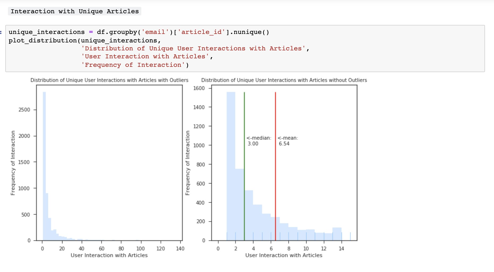
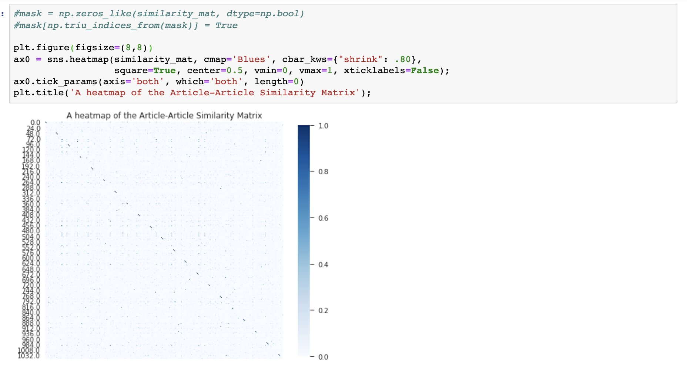
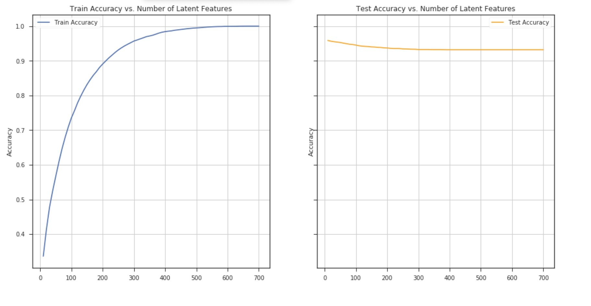

# Making Article Recommendations with IBM
Making Article Recommendations with IBM

---

## Overview
In this project, I worked on making article recommendations using interactions that users have with articles on the IBM Watson Studio platform. The project worked in three distinct sections. The sections included an analysis of the provided dataset and making recommendations to customers about articles they might like using three techniques. These include User-User Based Collaborative Filtering, matrix factorization and Content Based Recommendation using Natural Language Processing. The last section, developing an application, is still in progress.

## Folder Structure
This repository contains only the notebooks for file exploration
Main Folder
   |--Recommendations_with_IBM.ipynb 
   |  
   |--Recommendations_with_IBM.html  
   |  
   |--images: A folder containing image screenshots  
   |  
   |--files.zip: A zipped folder containing test and data files 
   |  
   |--README.md  

## Process Descriptions
The project can be separted into six sections, each with their contributions to the application.

1. **Exploratory Data Analysis**
    Before making recommendations of any kind, I needed to explore the data for the project.

2. **Rank Based Recommendations**
    I first found the most popular articles simply based on the most interactions. Since there are no ratings for any of the articles, I recommended the most popular articles to users.

3. **User-User Based Collaborative Filtering**
    In order to build better recommendations for the users of IBM's platform, I looked at users that are similar in terms of the items they have interacted with. These items could then be recommended to the similar users.

4. **Content Based Recommendations**
    Using your NLP, I solved for some ways to make content based recommendation system using NLTK and a TFIDF embedding. We calculate similar articles using cosine similarity, making recommendations using the articles most similar to those a user has interacted with.

5. **Matrix Factorization**
    Finally, I completed a machine learning approach to building recommendations. Using the user-item interactions, I built out a matrix decomposition. Using the decomposition, I was able to get an idea of how well you can predict new articles an individual might interact with.

6. **Building and Deploying A Flask App**
    This section of the project is still in operation and will be updated as soon as finished...

## Instructions
1. Extract the zipped file and move all file content to the root folder of the project.

## Acknowledgements
The startup code and tutorials that helped define this project were courtesy of Udacity.
