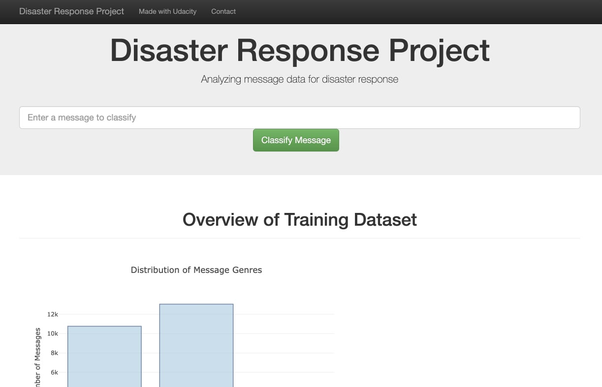
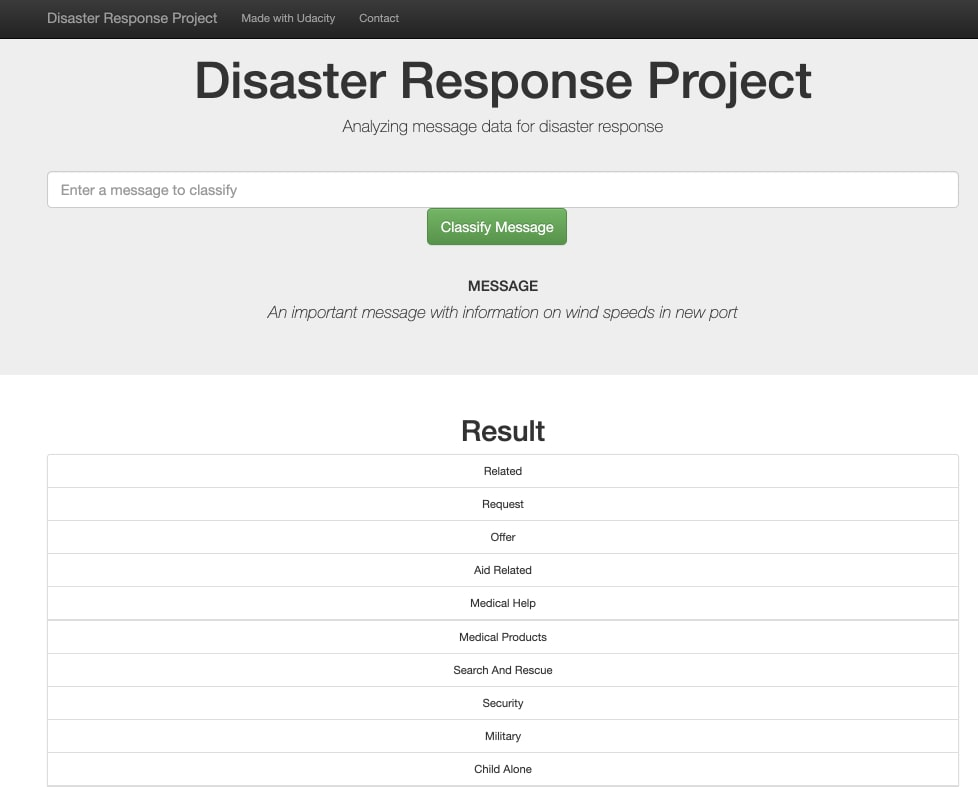
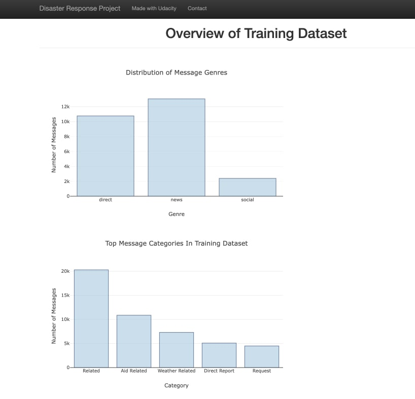
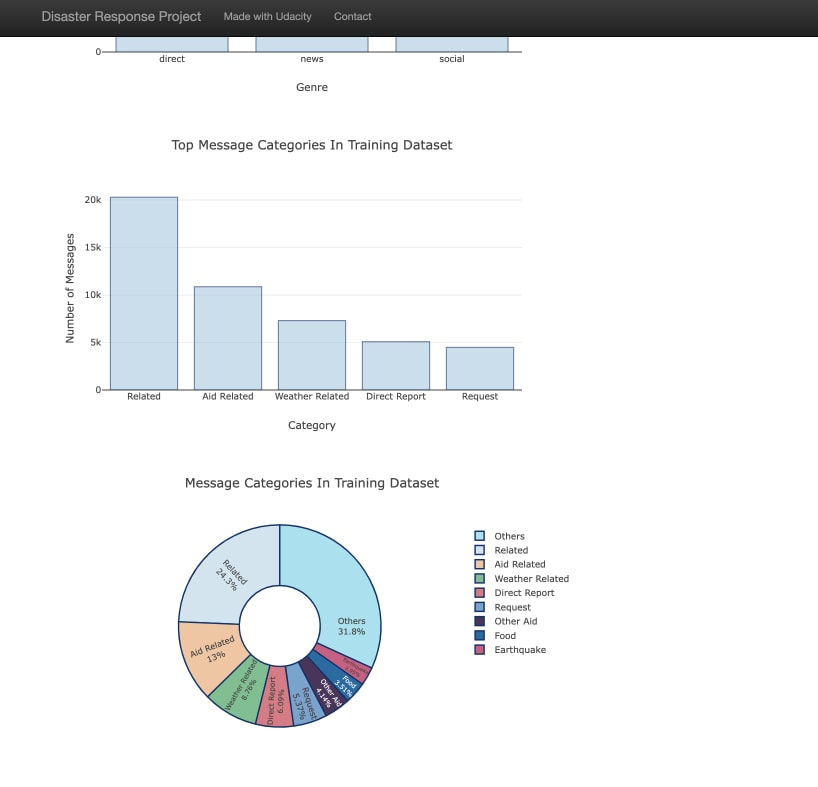

# Disaster Response Pipeline Project
Classifying messages for response and relief agencies. 

---

## Table Of Contents
 - [Overview](#overview)
 - [Project Structure](#project-structure)
 - [Process Descriptions](#process-descriptions)
 - [Instructions On Running The Project](#instructions-on-running-the-project)
 - [Dataset](#dataset)
 - [Acknowledgements](#acknowledgements)

## Overview
In this project, I applied some data ETL data engineering skills to analyze disaster data from [Figure Eight](https://www.figure-eight.com/). The data contained real messages that were sent during disaster events and this project covered creating a machine learning pipeline to categorize these events so that classified messages can be routed to the appropriate disaster relief agency. The project included building an interface (web application) where an emergency worker can input a new message and get classification results in several categories. The web app also displays visualizations of the training data.

## Project Structure
Disaster Response Main Folder
   |--app  
   |   |--templates  
   |   |    |--master.html #home html page  
   |   |    |--go.html #message result response html page  
   |   |--run.py  #main flask file  
   |  
   |--data  
   |   |--disaster_categories.csv #text data to process  
   |   |--disaster_messages.csv  #text data to process  
   |   |--DisasterResponse.db  #the database save  
   |   |--process_data.py  #python file for data processing & cleaning  
   |  
   |--models  
   |   |--classifier.pkl.csv #saved classifier of the ml model  
   |   |--train_classifier.py  #python script to train model on data  
   |  
   |--images #store for readme images  
   |  
   |--README.md  
   |--requirements.txt 

## Process Descriptions
The project can be separted into three sections, each with their contributions to the application.

1. **ETL Pipeline**
A Python script, `process_data.py`, that runs a data cleaning pipeline that:

 - Loads the messages and categories datasets
 - Merges the two datasets
 - Cleans the data
 - Stores it in a SQLite database

2. **ML Pipeline**
In a Python script, `train_classifier.py`, that runs a machine learning pipeline that:

 - Loads data from the SQLite database
 - Splits the dataset into training and test sets
 - Builds a text processing and machine learning pipeline
 - Trains and tunes a model using GridSearchCV
 - Outputs results on the test set
 - Exports the final model as a pickle file

3. **Flask Web Application**
A flask web app visualizes message training data and provides a simple interface where workers can worker can input a new message and get classification results in several categories. Images below:

## Instructions On Running The Project
1. Run the following commands in the project's root directory to set up the database and classifier model.

    - To run ETL pipeline that cleans data and stores in database
        `python data/process_data.py data/disaster_messages.csv data/disaster_categories.csv data/DisasterResponse.db`

    - To run ML pipeline that trains classifier and saves to disk
        `python models/train_classifier.py data/DisasterResponse.db models/classifier.pkl`
        (Current model training will take a while. > An hour.)

2. Run the following command in the app's directory to run your web app.
    `python run.py`

3. Go to http://172.16.1.208:3001/ on your local machine to access web app.

## Dataset:
Our data consists of messages sent during disaster events. This data is categorized segemented into various multiclass, imbalanced categories. The data is split between the `categories.csv` and `disaster_messages.csv` files and cleaned data is stored in `DisasteraResponse.db`.
Classes are imbalanced and as such we have categories like the 'related' category making up the largest share of the messages. While the classifier in this repo does not handle this problem, we can deal with the data imbalance with a number of methods like oversampling/undersampling from underrepresented classes.

## Acknowledgements
Acknowledgements to Udacity for providing the Starter Code as well as reviewing project submissions.
