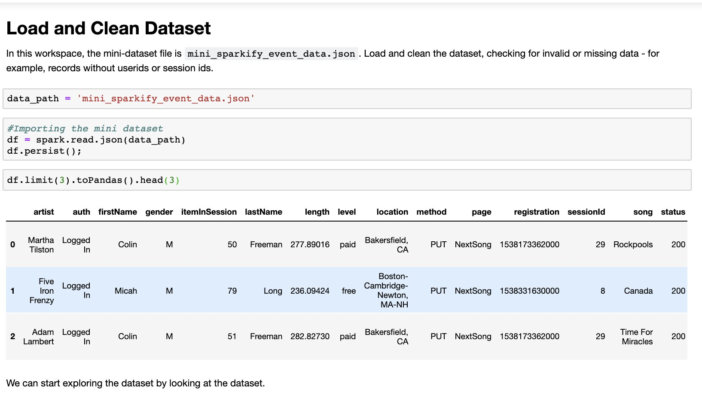
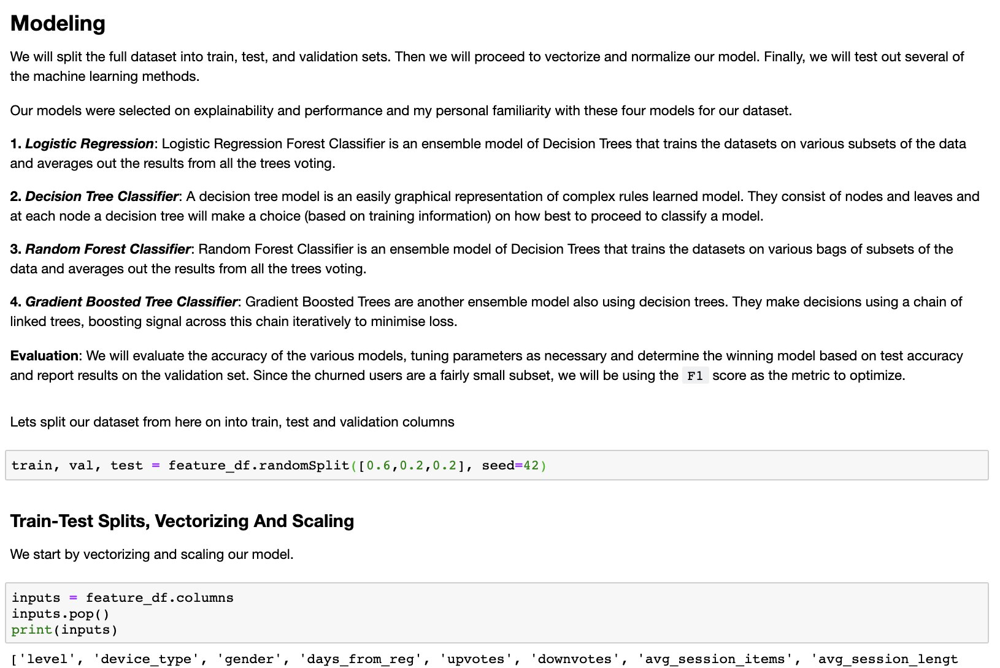

# Churn Prediction With Sparkify
Predicting churn on music streaming with Sparkify

---

## Overview
In this project, I worked on manipulating a large dataset with Spark to engineer relevant features for predicting churn. I used the Spark MLlib to build a classification model to predict churn.

Predicting churn rates is a challenging and common problem that data scientists and analysts regularly encounter in any customer-facing business. Additionally, the ability to efficiently manipulate large datasets with Spark is one of the highest-demand skills in the field of data.

The project covered:
Loading large datasets into Spark and manipulate them using Spark SQL and Spark Dataframes.
Using the machine learning APIs within Spark ML to build and tune models

## Folder Structure
This repository contains only the notebooks for file exploration
Main Folder
   |--Sparkify.ipynb  
   |  
   |--Sparkify.html  
   |  
   |--images: A folder containing image screenshots  
   |  
   |--README.md  

## Medium Blog Post
A technical writeup on the contents of this repository can be found in the medium link below. Visit the github to read about it. [Churn Prediction with Sparkify](https://medium.com/@kehindeadiguno/analysing-customer-churn-with-pyspark-b23329e4525c)

 
---
 

## Images

## Acknowledgements
The startup code and tutorials that helped define this project were courtesy of Udacity.
